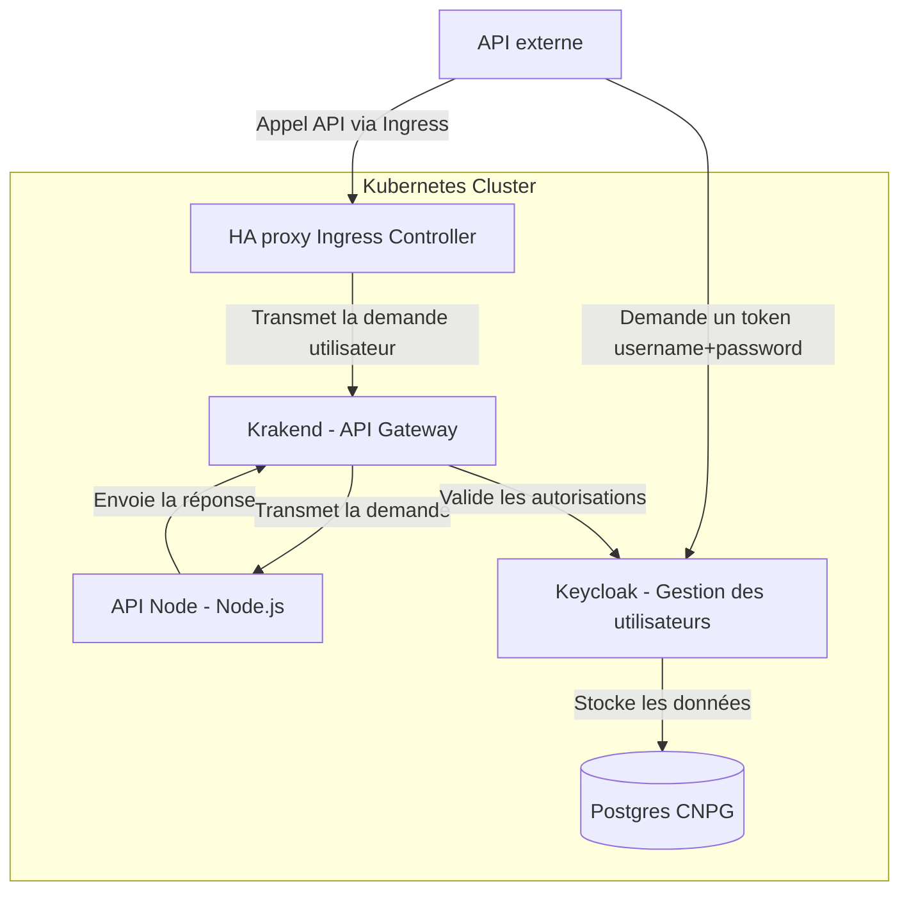
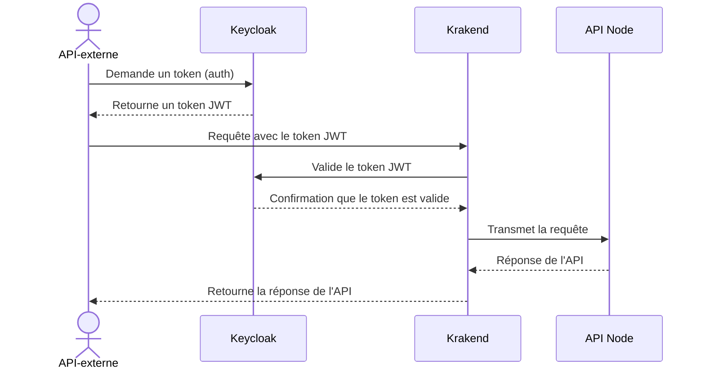

# APIM

## Cas d'usage

Cette solution s'adresse au projets qui exposent une API et ont un besoin de sécuriser ces endpoints.
Les projets qui souhaitent ajouter une couche de sécurité sur leur API sans avoir à gérer l'authentification et l'intégration avec le fournisseur d'identité dans leur code applicatif peuvent se tourner vers cette architecture.

Afin de vérifier les informations d'authentification fournies dans les requêtes (via header ou cookie), la solution s'intègre avec un fournisseur d'identité. Celui-ci peut être apporté par le projet si il dispose déjà d'un IDP et d'une base d'utilisateurs. Dans le cas contraire, le projet peut s'appuyer sur l'exemple d'implémentation de [Keycloak](../../sso/keycloak/README.md) proposé par la Service Team.

Les projets qui souhaitent utiliser cette solution ou l'adapter à leur cas d'usage sont invités à copier cet exemple et modifier le fichier `values.yaml` avec leur configuration (voir plus bas les valeurs typiques à modifier).

## Solution avec Krakend

La solution proposée déploie [Krakend](https://www.krakend.io/), une API Gateway qui permet donc d'exposer les endpoints d'une API et redirige les requêtes entrantes vers le back-end.
Krakend s'intègre avec un IDP (comme Keycloak) et permet d'ajouter une validation d'authentification sur les endpoints exposés.

En configurant Krakend, le projet peut définir pour chaque couple method & endpoint (ex : `GET /api/public`) les rôles autorisés à accéder à la ressource (ABAC/RBAC). L'utilisateur qui souhaite consommer une ressource de l'API doit donc s'authentifier auprès de l'IDP pour récupérer son access token et intégrer ce dernier au header authorization de sa requête. Krakend valide ensuite auprès de l'IDP que l'utilisateur associé au token fourni dispose bien d'un rôle autorisant l'accès à la ressource avant de transmettre la requête au back-end.
Krakend permet également d'appliquer de nombreux paramètres sur les requêtes qui peuvent être utiles au projet selon ses besoins, comme la configuration de rate limit sur l'API, le cache de token ou la modification de header à la volée (se référer à la [documentation officielle](https://www.krakend.io/docs/)).

L'architecture de référence complète proposée, incluant Krakend pour l'API Gateway, Keycloak pour la gestion des identités avec sa base de données CNPG et l'API du projet à sécuriser se présente comme suit :



La séquence typiques des flux lors d'une requête à l'API sécurisée via l'API Gateway est la suivante :



## Exemple de configuration

Dans l'exemple proposé dans ce dépôt, les projets peuvent retrouver l'implémentation de la validation d'authentification (testée avec Keycloak déployé comme dans l'exemple SSO).

Les valeurs suivantes sont fournies à titre d'exemple ou sont des placeholders à modifier par le projet avant de déployer la solution (fichier values.yaml). Il s'agit de paramètres Krakend sous forme de templates json. En particulier, les routes à exposer sont à définir :

| Key | Values |
| --- | ------ |
| `settings.urls.json` | `APIHost`: URL du service Kube vers le back-end avec le port </br> `JWKUrl`: URL du service Kube vers l'IDP (ex. Keycloak) avec le port et le path du protocole |
| `templates.endpoints.tmpl` | `endpoint`: Path exposé par Krakend </br> `method`: Verbe concerné </br> `backend.url_pattern`: Path cible vers le back </br> `extra_config.auth/validator.Roles`: Liste des rôles de l'IDP autorisés pour l'endpoint |
| `ingress.host` | URL externe pour exposer Krakend (et donc l'API Gateway) |

L'exemple expose 2 endpoints, à savoir `/api/public` qui redirige vers une ressource `/swagger/json` du back-end sans authentification et `/api/private1` qui redirige vers une ressource `/api/resource1` du back-end avec validation d'autorisation (les rôles `admin`, `readwrite` & `readonly` peuvent effectuer un `GET` mais seuls les rôles `admin` & `readwrite` peuvent effectuer un `POST`) :

```json
{
  "endpoint": "/api/public",
  "method": "GET",
  "backend": [
    {
      "host": ["{{ $host }}"],
      "url_pattern": "/swagger/json"
    }
  ]
},
{
  "endpoint": "/api/private1",
  "method": "GET",
  "backend": [
    {
      "host": ["{{ $host }}"],
      "url_pattern": "/api/resource1"
    }
  ],
  "input_headers": {{ include "input_header.txt"}},
  "extra_config": {
    "auth/validator": {{ template "auth_validator" (dict "JWKUrl" $JWKUrl "Roles" "[\"admin\", \"readwrite\", \"readonly\"]") }},
    "auth/jwk-client": {{ template "auth_jwk_client" . }},
    "modifier/lua-proxy": {{ template "lua_prescript" . }}
  }
},
{
  "endpoint": "/api/private1",
  "method": "POST",
  "backend": [
    {
      "host": ["{{ $host }}"],
      "url_pattern": "/api/resource1"
    }
  ],
  "input_headers": {{ include "input_header.txt"}},
  "extra_config": {
    "auth/validator": {{ template "auth_validator" (dict "JWKUrl" $JWKUrl "Roles" "[\"admin\", \"readwrite\"]") }},
    "auth/jwk-client": {{ template "auth_jwk_client" . }},
    "modifier/lua-proxy": {{ template "lua_prescript" . }}
  }
}
```

## Documentation Krakend (Helm chart)


This is a helm chart that deploys a [Krakend](https://www.krakend.io/) instance.

### Description

A Helm chart for deploying krakend.io in Kubernetes provided
and maintained by your friends at Equinix Metal

### Installation

* Add the Equinix Metal helm repository
```bash
helm repo add equinixmetal https://helm.equinixmetal.com
```

* Install the helm chart using default values
```bash
helm install krakend equinixmetal/krakend
```

> If you are using your own chart, reference the following to your chart's dependencies:
> ```yaml
> dependencies:
>   - name: krakend
>     version: v0.1.16
>     repository: "https://helm.equinixmetal.com"
> ```

### Usage

There are two main modes of operation:

* configMap-based: the configuration is stored in a configMaps and mounted in the
  container.

* all-in-one image: the configuration is stored in the container image itself.

Note that the all-in-one image method assumes that the configuration is stored
in the `/etc/krakend-src/config` path. This is done to allow for mounting
the license as describe in the section below.

Both modes of operation enable the flexible configuration feature. For the all-in-one
image, this is done so that the configuration can take environment variables into use.

Note that for a further description on how to use partials, settings and templates,
please refer to [the official krakend documentation](https://www.krakend.io/docs/configuration/flexible-config/).

### Values

| Key | Type | Default | Description |
|-----|------|---------|-------------|
| affinity | object | `{}` | The affinity to use for the krakend pod |
| autoscaling | object | `{"annotations":{},"behavior":{},"enabled":false,"maxReplicas":3,"minReplicas":1,"targetCPUUtilizationPercentage":50,"targetMemoryUtilizationPercentage":50}` | Configures HorizontalPodAutoscaler for your Deployment |
| deploymentAnnotations | object | `{}` | The annotations to use for the krakend deployment |
| deploymentType | string | `"deployment"` | The deployment type to use for the krakend service Valid values are `deployment` and `rollout` |
| extraVolumeMounts | array | `[]` | extraVolumeMounts allows you to mount extra volumes to the krakend pod |
| extraVolumes | array | `[]` | extraVolumes allows you to mount extra volumes to the krakend pod |
| fullnameOverride | string | `""` |  |
| image.pullPolicy | string | `"IfNotPresent"` | The image pull policy to use |
| image.registry | string | `"docker.io"` | The image registry to use |
| image.repository | string | `"devopsfaith/krakend"` | The image repository to use |
| image.tag | string | `"2.7.0"` | The image tag to use |
| imagePullSecrets | list | `[]` | List of secrets containing the credentials to use for the image |
| ingress | object | `{"annotations":{},"className":"","enabled":false,"hosts":[{"host":"chart-example.local","paths":[{"path":"/","pathType":"ImplementationSpecific"}]}],"tls":[]}` | The ingress settings to use for the krakend ingress |
| ingress.annotations | object | `{}` | The annotations to use for the ingress |
| ingress.className | string | `""` | The class to use for the ingress |
| ingress.enabled | bool | `false` | Specifies whether an ingress should be created |
| ingress.hosts | list | `[{"host":"chart-example.local","paths":[{"path":"/","pathType":"ImplementationSpecific"}]}]` | The list of hosts to use for the ingress |
| keda | object | `{"behavior":{},"cooldownPeriod":300,"enabled":false,"maxReplicas":3,"minReplicas":1,"pollingInterval":30,"restoreToOriginalReplicaCount":false,"scaledObject":{"annotations":{}},"triggers":[]}` | Configures a keda ScaledObject for your Deployment. It's mutually exclusive with hpa autoscaling |
| krakend.allInOneImage | bool | `false` | Whether the given krakend image to be used contains everything needed for the krakend service to run. If set to false, the image will be used as a base image and the configuration will be loaded from the configmap. Note that the all-in-one image assumes the krakend configuration is located at /etc/krakend-src/config/krakend.tmpl |
| krakend.config | string, optional | `""` | If set, this key will contain the full configuration of the krakend service |
| krakend.configFileSource | string, optional | `""` | an external file relative path, will contain the full configuration of the krakend service. useful if config file is generated with flexible config https://www.krakend.io/docs/configuration/flexible-config/ |
| krakend.env | array | `[]` | The environment variables to use for the krakend container. The default is just the ones needed to enable flexible configuration. |
| krakend.extraConfig | object | `{"router":{"@comment":"The health endpoint checks do not show in the logs","logger_skip_paths":["/__health"]}}` | The service-level "extra_config" settings. This will directly be translated to JSON and is added only if you're not fully overriding the configuration via the `config` setting. For more information, see https://www.krakend.io/docs/enterprise/configuration/ |
| krakend.partials | Object | `{"endpoints.tmpl":"[\n  {\n    \"endpoint\": \"/test\",\n    \"method\": \"GET\",\n    \"backend\": [\n        {\n            \"method\": \"GET\",\n            \"host\": [],\n            \"url_pattern\": \"/__debug/roots\",\n            \"encoding\": \"json\",\n            \"deny\": [\n                \"message\"\n            ]\n        }\n    ],\n    \"extra_config\": {\n        \"proxy\": {\n            \"static\": {\n                \"data\": {\n                    \"collection\": [\n                        {\n                            \"directories\": [\n                                \"Graceland\"\n                            ]\n                        }\n                    ],\n                    \"version\": \"deficient\"\n                },\n                \"strategy\": \"always\"\n            }\n        }\n    },\n    \"output_encoding\": \"json\"\n  }\n]","input_headers.tmpl":"\"input_headers\": [\n  \"Content-Type\",\n  \"ClientId\"\n]","rate_limit_backend.tmpl":"\"qos/ratelimit/proxy\": {\n  \"max_rate\": 0.5,\n  \"capacity\": 1\n}"}` | The default configuration has a partials files that will be used to load several aspects of the configuration. If you want to include expra partials, add or remove them here. |
| krakend.partialsDirSource | string, optional | `""` | an external file relative path, will contain the partial configuration files of the krakend service. |
| krakend.settings | object | `{"service.json":"{\n\t\"environment\": \"PRODUCTION\",\n\t\"default_host\": \"http://localhost:8080\",\n\t\"timeout\": \"3s\",\n\t\"cache_ttl\": \"3s\",\n\t\"output_encoding\": \"json\"\n}"}` | The default configuration has a settings files that will be used to load several aspects of the configuration. |
| krakend.settingsDirSource | string, optional | `""` | an external file relative path, will contain the setting configuration files of the krakend service. |
| krakend.templates | object | `{}` | While default configuration does not take into use templates; you may want to add your own templates here. Note that you'd need to set a custom configuration file to use them. |
| krakend.templatesDirSource | string, optional | `""` | an external file relative path, will contain the template configuration files of the krakend service. |
| lifecycle | object | `{}` | Krakend container lifecycle hooks (PostStart, PreStop) |
| livenessProbe | object | `{"httpGet":{"path":"/__health","port":"http"}}` | The livenessProbe to use for the krakend pod |
| nameOverride | string | `""` |  |
| networkPolicies | object | `{"enabled":false,"policies":[{"name":"allow-namespace1","namespace":"namespace1","type":"ingress"}]}` | The networkPolicies configures ingress NetworkPolicies for your application |
| networkPolicies.enabled | bool | `false` | Set to true to create NetworkPolicies for your application |
| networkPolicies.policies | list | `[{"name":"allow-namespace1","namespace":"namespace1","type":"ingress"}]` | List of NetworkPolicy objects |
| networkPolicies.policies[0] | object | `{"name":"allow-namespace1","namespace":"namespace1","type":"ingress"}` | Name of the NetworkPolicy |
| networkPolicies.policies[0].namespace | string | `"namespace1"` | Name of the namespace allowed to reach (or be reached by) your application |
| networkPolicies.policies[0].type | string | `"ingress"` | Type of the network policy (ingress or egress) |
| nodeSelector | object | `{}` | The nodeSelector to use for the krakend pod |
| podAnnotations | object | `{}` | The annotations to use for the krakend pod |
| podDisruptionBudget | object | `{"enabled":false,"maxUnavailable":"","minAvailable":1,"unhealthyPodEvictionPolicy":""}` | podDisruptionBudget allows you to define minumum and maximum available pods |
| podDisruptionBudget.enabled | bool | `false` | Set to true to create a default ServiceMonitor for your application |
| podDisruptionBudget.maxUnavailable | string | `""` | maximum available pods |
| podDisruptionBudget.minAvailable | int | `1` | minimum available pods |
| podDisruptionBudget.unhealthyPodEvictionPolicy | string | `""` | UnhealthyPodEvictionPolicy defines the criteria for when unhealthy pods should be considered for eviction |
| podLabels | object | `{}` | Labels to use for the krakend pod |
| podSecurityContext | object | `{}` | The securityContext to use for the krakend pod |
| readinessProbe | object | `{"httpGet":{"path":"/__health","port":"http"}}` | The readinessProbe to use for the krakend pod |
| replicaCount | int | `1` | Number of replicas to deploy |
| resources | object | `{}` | The resources to use for the krakend pod |
| securityContext | object | `{"allowPrivilegeEscalation":false,"capabilities":{"add":["NET_BIND_SERVICE"],"drop":["ALL"]},"readOnlyRootFilesystem":true,"runAsNonRoot":true,"runAsUser":1000}` | The securityContext to use for the krakend container |
| service | object | `{"annotations":{},"externalTrafficPolicy":"","metrics":{"enabled":false,"port":9100,"targetPort":9100},"port":80,"targetPort":8080,"type":"ClusterIP"}` | The service settings to use for the krakend service |
| service.annotations | object | `{}` | The annotations to use for the service |
| service.externalTrafficPolicy | string | `""` | The External Traffic Policy of the service |
| service.metrics | object | `{"enabled":false,"port":9100,"targetPort":9100}` | The service settings to reach the metrics port |
| service.metrics.enabled | bool | `false` | Specifies whether the metrics port is reachable |
| service.metrics.port | int | `9100` | The port to use for the metrics service |
| service.metrics.targetPort | int | `9100` | The target port to use for the metrics service |
| service.port | int | `80` | The port to use for the service |
| service.targetPort | int | `8080` | The target port to use for the service |
| service.type | string | `"ClusterIP"` | The type of service to use |
| serviceAccount.annotations | object | `{}` | The annotations to use for the service account |
| serviceAccount.create | bool | `true` | Specifies whether a service account should be created |
| serviceAccount.name | string | `""` | The name of the service account to use. If not set and create is true, a name is generated using the fullname template |
| serviceMonitor | object | `{"annotations":{},"enabled":false,"interval":"10s","scrapeTimeout":"10s","targetPort":9091}` | The serviceMonitor configures a ServiceMonitor for your application |
| serviceMonitor.annotations | object | `{}` | Annotations to add to ServiceMonitor |
| serviceMonitor.enabled | bool | `false` | Set to true to create a default ServiceMonitor for your application |
| serviceMonitor.interval | string | `"10s"` | Interval for scrape metrics. |
| serviceMonitor.scrapeTimeout | string | `"10s"` | time out interval when scraping metrics |
| serviceMonitor.targetPort | int | `9091` | prometheus metrics port exposed by krakend |
| strategy | object | `{}` | The strategy for the krakend deployment. This can either be a `deployment` or a `rollout` strategy. For more information on the Argo Rollout strategy, see https://argo-rollouts.readthedocs.io/en/stable/features/specification/ |
| tolerations | object | `[]` | The tolerations to use for the krakend pod |
| topologySpreadConstraints | array | `[]` | The topologySpreadConstraints to use for the krakend pod |

### Development

#### Prerequisites

- [helm](https://helm.sh/docs/intro/install/)
- [helm-docs](https://github.com/norwoodj/helm-docs)

#### Testing

Ensure that the documentation is up to date before pushing a pull request:

```bash
helm-docs
```

#### Releasing

There is a useful Makefile target that's useful to cut a release. So, simply do:

```bash
TAG=$RELEASE_VERSION make release
```

And the release will happen.

Note that this project follows the [Semantic Versioning scheme](https://semver.org/), so
make sure to follow it when cutting releases.

The `TAG` Makefile variable takes a release version without the `v` prefix. For example,
if you want to cut a release with version `v1.2.3`, you'd do:

```bash
TAG=1.2.3 make release
```

# Using Krakend.io Enterprise

Krakend.io Enterprise is a commercial product that extends the capabilities
of the open source Krakend.io API Gateway. It is available as a Docker image
that can be used as a drop-in replacement for the open source image.

In order to configure the helm chart to use it, you'd need a values file similar
as the following:

```yaml
image:
  registry: docker.io
  repository: krakend/krakend-ee
  tag: "2.1.2"
extraVolumeMounts:
  - name: license
    mountPath: /etc/krakend/LICENSE
    readOnly: true
extraVolumes:
  - name: license
    secret:
      secretName: krakend-license
```

Note the mount of the license file in the `/etc/krakend/LICENSE` path.
