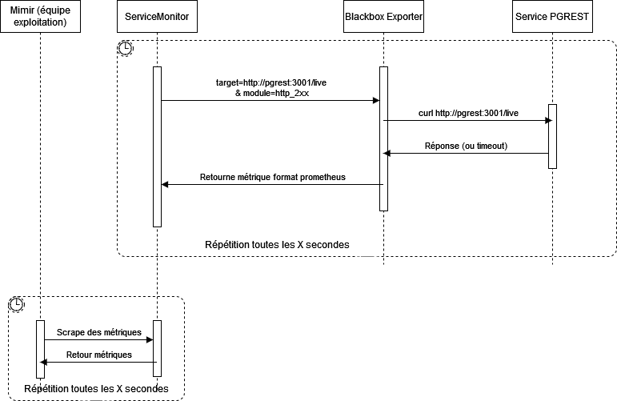

# Blackbox
[Prometheus blackbox](https://github.com/prometheus/blackbox_exporter) est un exporter prometheus spécialiser pour interroger des urls et retouner des informations de cette interrogation au format prometheus (si l'interrogation s'est bien déroulé, combien de temps pour effectuer la requête, le code de retour http, etc...).

Ce dossier contient un exemple de configuration pour un déploiment sur kubernetes (exemple basé sur l'écoute d'un service postgrest).

## Fonctionnement
Blackbox a besoin d'une target (aka une url), optionnellement un module (comment effectuer la requête et traier la réponse du serveur - par défaut les réponses HTTP 200 sont valides).

Par défaut, blackbox écoute sur le port 9115

```
curl http://blackbox:9115/probe?target=http://monurl/live
```

La métrique la plus intéressante est probe_success, qui retourne 1 si l'interrogation de l'url a réussi d'après le module fourni.
```
# HELP probe_dns_lookup_time_seconds Returns the time taken for probe dns lookup in seconds
# TYPE probe_dns_lookup_time_seconds gauge
probe_dns_lookup_time_seconds 0.000847574
# HELP probe_duration_seconds Returns how long the probe took to complete in seconds
# TYPE probe_duration_seconds gauge
probe_duration_seconds 0.002591255
# HELP probe_failed_due_to_regex Indicates if probe failed due to regex
# TYPE probe_failed_due_to_regex gauge
probe_failed_due_to_regex 0
# HELP probe_http_content_length Length of http content response
# TYPE probe_http_content_length gauge
probe_http_content_length -1
# HELP probe_http_duration_seconds Duration of http request by phase, summed over all redirects
# TYPE probe_http_duration_seconds gauge
probe_http_duration_seconds{phase="connect"} 0.000676965
probe_http_duration_seconds{phase="processing"} 0.000663609
probe_http_duration_seconds{phase="resolve"} 0.000847574
probe_http_duration_seconds{phase="tls"} 0
probe_http_duration_seconds{phase="transfer"} 0.000119573
# HELP probe_http_redirects The number of redirects
# TYPE probe_http_redirects gauge
probe_http_redirects 0
# HELP probe_http_ssl Indicates if SSL was used for the final redirect
# TYPE probe_http_ssl gauge
probe_http_ssl 0
# HELP probe_http_status_code Response HTTP status code
# TYPE probe_http_status_code gauge
probe_http_status_code 200
# HELP probe_http_uncompressed_body_length Length of uncompressed response body
# TYPE probe_http_uncompressed_body_length gauge
probe_http_uncompressed_body_length 0
# HELP probe_http_version Returns the version of HTTP of the probe response
# TYPE probe_http_version gauge
probe_http_version 1.1
# HELP probe_ip_addr_hash Specifies the hash of IP address. It's useful to detect if the IP address changes.
# TYPE probe_ip_addr_hash gauge
probe_ip_addr_hash 8.46910751e+08
# HELP probe_ip_protocol Specifies whether probe ip protocol is IP4 or IP6
# TYPE probe_ip_protocol gauge
probe_ip_protocol 4
# HELP probe_success Displays whether or not the probe was a success
# TYPE probe_success gauge
probe_success 1
```

*Diagramme de séquence*




### Urls
Les urls suivantes sont disponibles:
- /probe: sonde une url et retourne les métriques liés à ce sondage
- /config: affiche la config
- /metrics: affiche les métriques liées à blackbox (ne pas confondre avec /probe qui renvoie des métriques mais celle de l'url sondée)

### Modules:
Les modules permettent de définir le comportement de blackbox pour effectuer la requête (utilisation d'IPv4/6, TLS, token d'authentification) et quelles sont les retours considérés comme valide.


## Exemple

- configmap.yml: contient la configuration de blackbox, c'est à dire la configuration des modules utilisables (non obligtoire, il existe des modules par défaut)
- token.secret.yml: contient le token JWT utilisé pour authentifié la sonde
- deployment.yml: utilise l'image de bitnami, met en place la configuration dans le fichier `/opt/bitnami/blackbox-exporter/conf/config.yml` et un token JWT dans `/opt/bitnami/blackbox-exporter/token/credential.token`
- service.yml: permet d'interroger le pod contenant l'exporter blackbox
- servicemonitor.yml: ServiceMonitor interrogeant le service blackbox en lui fournissant les targets et modules à utiliser.
- prometheus.rules.yml: PrometheusRule permettant de créer une alerte d'après une sonde blackbox

ServiceMonitor est une CRD de prometheus-operator, voir la [documentation](https://github.com/prometheus-operator/prometheus-operator/blob/main/Documentation/user-guides/getting-started.md).

Cela permet d'interroger à interval régulier des services qui doivent répondre au format prometheus.


PrometheusRule est une crd de prometheus-operator, voir la [documentation](https://github.com/prometheus-operator/prometheus-operator/blob/main/Documentation/user-guides/alerting.md)

Un site regroupant des configurations d'alerte pour prometheus: voir [ici](https://samber.github.io/awesome-prometheus-alerts/rules.html#blackbox)